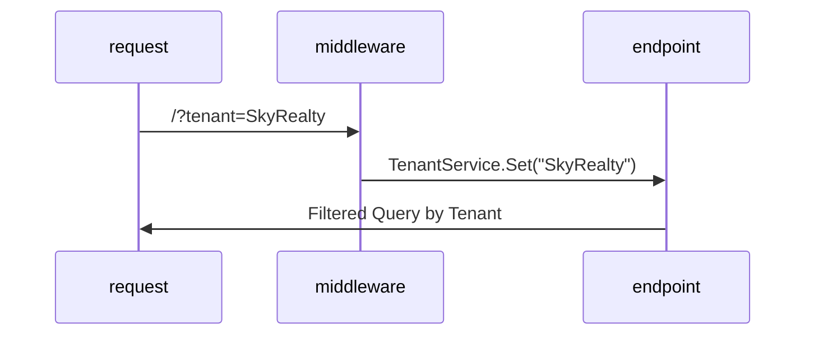

# RentSaaS

 
**Diagram**
high-level diagram illustrating the system’s structure:

                  +-------------+
                  |   Angular   |
                  |   Frontend  |
                  +------+------+  
                         |
         HTTPS/REST      |
                         v
     +---------------------------------------+
     |        API Gateway / Load Balancer   |
     +---------------------------------------+
         |        |            |       |      
         |        |            |       |      
         v        v            v       v      
  +-----------+ +-----------+ +-------------+ +-------------------+ 
  |  Payment  | | Rental    | |   Landlord  | | Communication/    |
  |  Service  | | Application| |   Service   | | Notification Svc  |
  +-----------+ +-----------+ +-------------+ +-------------------+
         |              |            |
         |   DB Calls   |            |  DB Calls
         v              v            v
  +-------------------------------------------------+
  |     MS SQL (Properties, Tenants, Applications)  |
  +-------------------------------------------------+
         |
  +-------------------+ 
  | Redis Cache       | 
  +-------------------+
     |
     +----------------+ 3rd-Party Integrations
     |  Stripe /      | <--- Payment   
     |  Twilio /      | <--- SMS  
     |  SendGrid /    | <--- Email  
     |  Credit Check  | <--- Tenant Screening  
     +----------------+

RentSaaS.sln
│
├── src/
│   ├── RentSaaS.API                     # API Project (Controllers)
│   │   ├── Controllers/
│   │   │   └── ExpensesController.cs
│   │   └── Startup.cs
│   │
│   ├── RentSaaS.Application             # Application Layer
│   │   ├── Services/
│   │   │   ├── Interfaces/              # Service Interfaces
│   │   │   │   └── IExpensesService.cs
│   │   │   └── Implementations/         # Service Implementations
│   │   │       └── ExpensesService.cs
│   │   │
│   │   ├── DTOs/                        # Data Transfer Objects
│   │   │   ├── Expenses/
│   │   │   │   ├── ExpenseDto.cs
│   │   │   │   ├── CreateExpenseDto.cs
│   │   │   │   └── ...
│   │   │   └── Common/
│   │   │       ├── PaginatedResponse.cs
│   │   │       └── ...
│   │   │
│   │   └── Mappings/                    # AutoMapper Profiles
│   │       └── ExpenseMappingProfile.cs
│   │
│   ├── RentSaaS.Domain                  # Domain Layer
│   │   ├── Entities/
│   │   │   ├── Expense.cs
│   │   │   └── ExpenseCategory.cs
│   │   │
│   │   ├── Interfaces/
│   │   │   └── Repositories/
│   │   │       └── IExpenseRepository.cs
│   │   │
│   │   └── ValueObjects/
│   │
│   ├── RentSaaS.Infrastructure          # Infrastructure Layer
│   │   ├── Data/
│   │   │   ├── Context/
│   │   │   │   └── ApplicationDbContext.cs
│   │   │   │
│   │   │   └── Repositories/
│   │   │       └── ExpenseRepository.cs
│   │   │
│   │   ├── Services/
│   │   │   └── External/
│   │   │
│   │   └── Migrations/
│   │
│   └── RentSaaS.Shared                  # Shared Layer
│       ├── Constants/
│       ├── Extensions/
│       └── Helpers/
│
├── tests/
│   ├── RentSaaS.API.Tests
│   ├── RentSaaS.Application.Tests
│   ├── RentSaaS.Domain.Tests
│   └── RentSaaS.Infrastructure.Tests
│
└── docker/
    └── docker-compose.yml